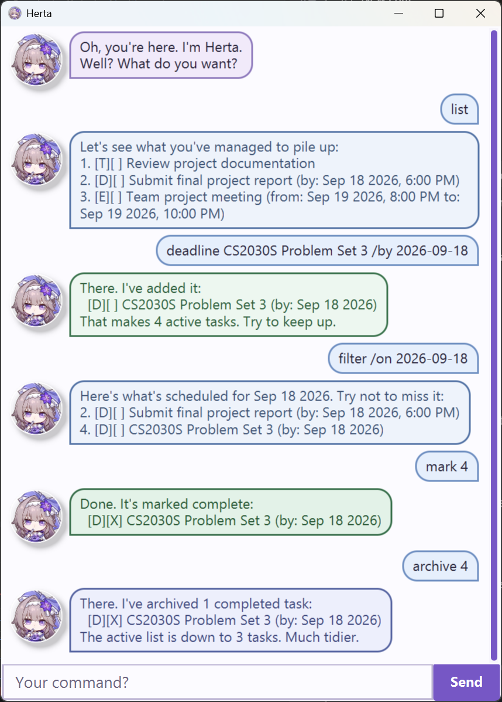

# Herta User Guide

## Contents

- [Quick start](#quick-start)
- [Understanding Herta](#understanding-herta)
- [Features](#features)
- [GUI shortcuts](#gui-shortcuts)
- [Saving and transferring data](#saving-and-transferring-data)
- [Command summary](#command-summary)

## Introduction

Herta is a desktop task manager combining typed commands with a graphical,
chat-style interface. It manages todos, deadlines, and events in one place. It
suits fast keyboard users.

## Quick start

1. Ensure that Java 25 or later is installed on your computer.
2. Download `Herta.jar` from the [latest release](https://github.com/hhkennn/ip/releases/latest).
3. Copy it to Herta's home folder.
4. Open a terminal in that folder and run:

   ```text
   java -jar Herta.jar
   ```

5. Wait for the Herta window to appear.

6. Enter a command and press Enter or click **Send**.
7. Try these commands first:

   ```text
   todo read the user guide
   list
   ```

## Understanding Herta

The screenshot below shows an example session after tasks have been added.
Commands are entered at the bottom, and responses appear in the conversation
area.



### Command notation

This guide uses `UPPER_CASE` for supplied values. Items in `[square
brackets]` are optional, and `...` means the preceding item may repeat.
Enter each command on one line. Command names and markers such as `/by` are
lowercase. Commands that take no arguments reject extra arguments.

For example, in `deadline DESCRIPTION /by DATE_OR_DATE_TIME`, replace
`DESCRIPTION` and `DATE_OR_DATE_TIME` with your own values, but type `deadline`
and `/by` exactly as shown.

### Task types and statuses

Tasks show a number, type, status, and description. Dated tasks also show their
date or time. For example:

`2. [D][X] submit report (by: Oct 15 2026, 6:00 PM)`

| Symbol | Meaning |
| --- | --- |
| `2.` | The task's number in the active list |
| `[T]` | Todo |
| `[D]` | Deadline |
| `[E]` | Event |
| `[ ]` | Incomplete |
| `[X]` | Complete |

Newly created tasks are incomplete.

### Task numbers

> [!IMPORTANT]
> Commands such as `mark`, `delete`, and `archive` use numbers from the active task list. Search, filter, upcoming, and sorted views retain the original active-task numbers even when they show tasks in a different order or omit non-matching tasks.

Task numbers begin at 1. Deleting or archiving can renumber later active tasks.
Archived tasks use a separate numbering system shown by `archived`;
`restore` uses an archive number, not an active-task number.

### Supported date and time formats

| Input | Format | Example |
| --- | --- | --- |
| Date and time | `d/M/yyyy HHmm` | `2/12/2026 1800` |
| Date and time | `yyyy-MM-dd HHmm` | `2026-12-02 1800` |
| Date and time | `yyyy-MM-dd HH:mm` | `2026-12-02 18:00` |
| Date only (`deadline`, `event`, and `filter`) | `d/M/yyyy` or `yyyy-MM-dd` | `2/12/2026` or `2026-12-02` |

A date-only deadline or event endpoint represents midnight at the beginning of
that date. Events must end after they start. Dates must be valid between
`0001-01-01` and `9999-12-31`, and past dates are accepted. Displayed dates
always use English month names. Natural-language dates such as
`tomorrow` and `next Friday` are not supported.

When creating a task, its description must contain visible text. Ordinary
spaces and Unicode text are supported, but descriptions cannot contain the
vertical-bar character, line breaks, control characters, or unsupported
invisible spacing characters. Keep descriptions under 1,000 characters. Herta
permits duplicate tasks in either list and across both lists.

## Features

### Adding a todo: `todo`

Adds an incomplete task without a date or time.

Format: `todo DESCRIPTION`

Example: `todo buy groceries`

The description is required. A todo has no date, so `filter` and `upcoming`
exclude it; `sort date` places it after dated tasks.

### Adding a deadline: `deadline`

Adds an incomplete task with a due date or time.

Format: `deadline DESCRIPTION /by DATE_OR_DATE_TIME`

Example: `deadline submit report /by 2026-10-15 18:00`

The `/by` marker is required and may appear only once. Use the supported
formats described earlier.

### Adding an event: `event`

Adds an incomplete task with a start and end date or time.

Format: `event DESCRIPTION /from START /to END`

Example: `event project meeting /from 2026-10-15 1800 /to 2026-10-15 2000`

`/from` must appear before `/to`; both markers are required and may appear
only once. The ending date and time must be later than the starting date and
time.

### Listing active tasks: `list`

Displays all active tasks in their saved order.

Format: `list`

Archived tasks are excluded. With no active tasks, Herta displays the normal
list heading without task entries.

### Finding tasks by description: `find`

Searches active-task descriptions for a keyword or phrase.

Format: `find KEYWORD`

Example: `find report`

Matching is case-insensitive and uses substrings, so `book` matches `read book`.
The whole keyword or phrase is one substring, not an OR search over separate
words. Results retain their original active-task numbers.

### Viewing tasks on a date: `filter`

Shows dated active tasks that occur on a specified calendar date.

Format: `filter /on DATE`

Example: `filter /on 2026-10-15`

It includes deadlines due on that date and events overlapping any part of it.
Both complete and incomplete tasks are included; todos are excluded because
they have no date. Results retain their original active-task numbers.

### Viewing upcoming tasks: `upcoming`

Shows incomplete dated tasks in a future time window.

Format: `upcoming DAYS`

Example: `upcoming 7`

`DAYS` must be a positive whole number. It includes deadlines due within the
window and events whose start falls within it, but excludes todos and completed
tasks. The window begins now and ends `DAYS` days later. Results retain their
original active-task numbers.

### Displaying tasks in date order: `sort`

Displays active tasks chronologically without changing their saved order.

Format: `sort date`

Dated tasks are ordered by a deadline's due time or event's start time. Todos
appear after dated tasks, and equal times retain their existing order. Original
active-task numbers remain visible.

### Marking a task complete: `mark`

Marks an active task as complete.

Format: `mark INDEX`

Example: `mark 2`

`INDEX` must be a positive number currently present in the active list.

### Marking a task incomplete: `unmark`

Marks a completed active task as incomplete again.

Format: `unmark INDEX`

Example: `unmark 2`

It remains in its existing active-list position.

### Deleting a task: `delete`

Permanently removes an active task.

Format: `delete INDEX`

Example: `delete 2`

Remaining tasks are renumbered after deletion. Herta has no undo command, so
check the number before deleting.

### Archiving completed tasks: `archive`

Moves completed active tasks to the archive using numbers, inclusive ranges, or
`archive all`.

Formats: `archive TASK_NUMBER_OR_RANGE [MORE_TASK_NUMBERS_OR_RANGES]...` or
`archive all`

Examples: `archive 2`, `archive 1 3-5 8`, and `archive all`

Explicit selections may mix numbers and ranges. Every selected task must be
complete and valid; otherwise nothing is archived. Repeated or overlapping
selectors are de-duplicated, and archive order follows active-list order.
`archive all` moves every completed active task and leaves incomplete tasks
active; do not combine `all` with selectors.

### Viewing archived tasks: `archived`

Displays the archive.

Format: `archived`

Archived tasks use independent numbers beginning at 1; active tasks are not
displayed.

### Restoring an archived task: `restore`

Moves one archived task back to the active list.

Format: `restore ARCHIVE_INDEX`

Example: `restore 1`

Use the number shown by `archived`, not an active-task number. The task is
appended to the active list with its type, description, dates, and completion
status preserved. Remaining archived tasks are renumbered.

### Exiting Herta: `bye`

Exits the application.

Format: `bye`

The GUI briefly displays Herta's goodbye response before closing.

## GUI shortcuts

| Action | Shortcut |
| --- | --- |
| Submit a command | Enter or click **Send** |
| Move focus between the command box, **Send** button, and conversation area | Tab |
| Recall an older submitted command | Up arrow |
| Move toward newer commands or restore the unfinished draft | Down arrow |
| Increase message and avatar size | `Ctrl` + `+` or Ctrl+mouse-wheel up |
| Decrease message and avatar size | `Ctrl` + `-` or Ctrl+mouse-wheel down |
| Reset zoom | `Ctrl` + `0` |
| Copy a complete message | Right-click it and select **Copy** |

## Saving and transferring data

Successful modifying commands save automatically; no manual save command is
required. By default, active tasks are in `data/herta.txt`, and archived tasks
are in `data/archive.txt`. The `data` folder is relative to Herta's launch
directory.

Missing task files are treated as empty and created when Herta next saves. To
transfer data, close Herta and copy both files into the corresponding `data`
folder on the other computer.

> [!CAUTION]
> Close Herta and back up both data files before editing, replacing, or transferring them. Invalid or inaccessible saved data prevents Herta from accepting commands, while preserving the existing files.

## Command summary

| Action | Format |
| --- | --- |
| Add a todo | `todo DESCRIPTION` |
| Add a deadline | `deadline DESCRIPTION /by DATE_OR_DATE_TIME` |
| Add an event | `event DESCRIPTION /from START /to END` |
| List active tasks | `list` |
| Find tasks by description | `find KEYWORD` |
| View tasks on a date | `filter /on DATE` |
| View upcoming tasks | `upcoming DAYS` |
| Display tasks chronologically | `sort date` |
| Mark a task complete | `mark INDEX` |
| Mark a task incomplete | `unmark INDEX` |
| Delete an active task | `delete INDEX` |
| Archive completed tasks | `archive TASK_NUMBER_OR_RANGE [MORE_TASK_NUMBERS_OR_RANGES]...` or `archive all` |
| View archived tasks | `archived` |
| Restore an archived task | `restore ARCHIVE_INDEX` |
| Exit Herta | `bye` |
